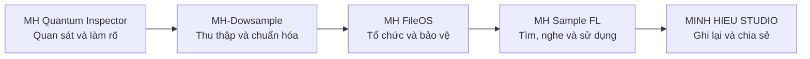

<div align="center">

# MH FileOS

### Hệ thống nghiên cứu quản lý file local-first, ưu tiên an toàn và khả năng phục hồi


[Website](https://studiominhhieu.com/) · [Kế hoạch](PLANS.md) · [Nguyên tắc an toàn](docs/SAFETY-INVARIANTS.md) · [Liên hệ](mailto:support@studiominhhieu.com)

</div>

> [!IMPORTANT]
> MH FileOS hiện là **dự án nghiên cứu cá nhân**. Lát cắt hiện tại chỉ chạy read-only trên dữ liệu thử nghiệm do testkit tạo. Dự án chưa có UI hoàn chỉnh, chưa có installer chính thức và chưa sẵn sàng chạy trên dữ liệu quan trọng của người dùng.

## Mục lục

- [Vấn đề dự án muốn giải quyết](#vấn-đề-dự-án-muốn-giải-quyết)
- [Vị trí trong hệ sinh thái MH](#vị-trí-trong-hệ-sinh-thái-mh)
- [Nguyên tắc cốt lõi](#nguyên-tắc-cốt-lõi)
- [Trạng thái hiện tại](#trạng-thái-hiện-tại)
- [Mục tiêu MVP](#mục-tiêu-mvp)
- [Chạy demo read-only](#chạy-demo-read-only)
- [Cách đọc kết quả](#cách-đọc-kết-quả)
- [Những gì chưa có](#những-gì-chưa-có)
- [Cấu trúc dự án](#cấu-trúc-dự-án)
- [Tài liệu nguồn sự thật](#tài-liệu-nguồn-sự-thật)
- [Quy tắc cho coding agent](#quy-tắc-cho-coding-agent)
- [Lộ trình](#lộ-trình)
- [Liên hệ](#liên-hệ)

## Vấn đề dự án muốn giải quyết

File trên máy tính thường tích tụ qua nhiều năm: trùng lặp, tên khó hiểu, nằm sai chỗ, thiếu nguồn gốc hoặc không rõ thao tác nào sẽ ảnh hưởng đến dữ liệu nào.

MH FileOS được tạo ra để nghiên cứu một quy trình khác với kiểu “bấm dọn dẹp rồi hy vọng không mất dữ liệu”:

```text
Hiểu dữ liệu
→ Phát hiện vấn đề
→ Lập kế hoạch
→ Người dùng xem và duyệt
→ Thực hiện có giao dịch
→ Kiểm chứng
→ Ghi nhật ký
→ Có thể phục hồi
```

Mục tiêu đầu tiên là phục vụ chính nhu cầu quản lý dữ liệu của Minh Hiếu. Chỉ khi có đủ bằng chứng an toàn và kiểm thử, dự án mới được cân nhắc chia sẻ rộng hơn.

## Vị trí trong hệ sinh thái MH



MH FileOS là lớp tổ chức và bảo vệ. Nó không chỉ dành cho audio, nhưng trong chuỗi sample, nó có nhiệm vụ hiểu file, lập chỉ mục, phát hiện vấn đề và chuẩn bị thao tác an toàn trước khi dữ liệu đi vào MH Sample FL.

## Nguyên tắc cốt lõi

Thứ tự ưu tiên không được đảo ngược:

1. Không làm mất dữ liệu.
2. Kết quả phải đúng.
3. Mọi hành động phải giải thích được.
4. Có kiểm chứng và khả năng phục hồi.
5. Hiệu năng tốt.
6. Giao diện dễ hiểu.
7. Tự động hóa chỉ được thêm sau cùng.

> [!WARNING]
> Nếu một tính năng nhanh hoặc đẹp nhưng làm giảm khả năng kiểm chứng, an toàn hoặc phục hồi, tính năng đó phải bị hoãn.

## Trạng thái hiện tại

**Execution Plan:** `EP-000`  
**Milestone:** `M6 — read-only vertical slice`  
**Dữ liệu chạy:** synthetic fixture  
**Mutation trên dữ liệu người dùng:** chưa có

### Đã có bằng chứng

- Tạo dữ liệu thử nghiệm có manifest xác định trước.
- Scan read-only.
- Lập catalog vào SQLite artifact.
- Xuất JSON summary không chứa path dữ liệu thật.
- So sánh kết quả với manifest.
- Chụp snapshot trước và sau để xác nhận source không đổi.
- Cleanup sandbox sau khi hoàn tất.

### Ý nghĩa của trạng thái `verified`

Một lần chạy chỉ được đánh dấu `verified` khi:

1. summary khớp manifest;
2. snapshot trước và sau giống nhau;
3. không có mutation trên source fixture;
4. sandbox đã được dọn sạch.

## Mục tiêu MVP

MVP chỉ được xem là đạt khi hoàn thành toàn bộ chuỗi:

```text
Scan read-only
→ Catalog
→ Findings
→ Action Plan
→ User Approval
→ Transactional Execution
→ Verification
→ Journal
→ Undo / Recovery
```

Không được bỏ qua bước người dùng phê duyệt. Không được tự động xóa, ghi đè hoặc di chuyển file ngoài một kế hoạch đã được xem và chấp thuận.

## Chạy demo read-only

### Yêu cầu

- Rust toolchain phù hợp với `Cargo.lock`.
- PowerShell hoặc terminal có thể chạy Cargo.
- Repository đã được clone đầy đủ.

### Lệnh demo

```powershell
cargo run --quiet -p fileos-cli --example fixture-catalog-demo --locked --offline
```

Lệnh này:

1. tạo synthetic fixture trong sandbox;
2. scan fixture ở chế độ chỉ đọc;
3. ghi catalog SQLite dưới thư mục artifact;
4. tạo summary JSON;
5. đối chiếu manifest và snapshot;
6. cleanup sandbox.

Lệnh **không nhận đường dẫn dữ liệu người dùng** và không nên được mô tả như một công cụ dọn file hoàn chỉnh.

## Cách đọc kết quả

Khi demo thành công, cần kiểm tra:

- số lượng file và folder có khớp manifest không;
- summary có trạng thái `verified` không;
- snapshot nguồn trước và sau có giống nhau không;
- artifact có nằm đúng trong thư mục quy định không;
- sandbox có được cleanup không.

Nếu chỉ chạy được command nhưng thiếu một trong các bằng chứng trên, milestone chưa được coi là hoàn tất.

## Những gì chưa có

- UI desktop cho người dùng cuối.
- Installer Windows chính thức.
- Scan dữ liệu người dùng thật.
- Findings hoàn chỉnh cho nhiều loại vấn đề.
- Action Plan có giao diện phê duyệt.
- Transactional execution trên dữ liệu thật.
- Journal và undo/recovery hoàn chỉnh.
- Benchmark thư viện file lớn.
- Tài liệu phát hành và hỗ trợ người dùng.

Không được dùng crate name, mockup hoặc mã khung để tuyên bố các phần này đã hoàn thành.

## Cấu trúc dự án

```text
MH-FileOS/
├─ AGENTS.md
├─ PLANS.md
├─ README.md
├─ Cargo.toml
├─ Cargo.lock
├─ docs/
│  ├─ MASTER-PLAN.md
│  ├─ SAFETY-INVARIANTS.md
│  ├─ ARCHITECTURE.md
│  ├─ TEST-STRATEGY.md
│  ├─ SAFETY-TRACEABILITY.md
│  └─ adr/
├─ crates/
│  ├─ fileos-domain/
│  ├─ fileos-app/
│  ├─ fileos-testkit/
│  ├─ fileos-catalog/
│  ├─ fileos-scanner/
│  └─ fileos-platform-windows/
├─ apps/
│  └─ fileos-cli/
├─ scripts/
└─ fixtures/
```

Một crate xuất hiện trong workspace chỉ thể hiện ranh giới trách nhiệm, không đồng nghĩa toàn bộ hành vi đã triển khai.

## Tài liệu nguồn sự thật

Đọc theo thứ tự authority:

1. [`docs/SAFETY-INVARIANTS.md`](docs/SAFETY-INVARIANTS.md)
2. [`AGENTS.md`](AGENTS.md)
3. [`PLANS.md`](PLANS.md)
4. [`docs/ARCHITECTURE.md`](docs/ARCHITECTURE.md)
5. [`docs/TEST-STRATEGY.md`](docs/TEST-STRATEGY.md)
6. [`docs/MASTER-PLAN.md`](docs/MASTER-PLAN.md)

`MH-FILEOS-MASTER-PLAN-MVP-v1.0.md` ở root là tài liệu legacy. Khi xung đột, tài liệu đó không có authority cao hơn danh sách trên.

## Quy tắc cho coding agent

```text
Đọc tài liệu đúng authority order.
Chỉ làm milestone đang được chủ dự án phê duyệt.
Không tự tạo production feature.
Không tự cài dependency hoặc truy cập ngoài repository.
Trước khi sửa file, nêu phạm vi, rủi ro và tiêu chí hoàn thành.
Sau khi sửa, liệt kê file thay đổi và bằng chứng kiểm tra.
Không xóa, khóa hoặc làm mất lịch sử dự án khi chưa có lệnh rõ ràng.
```

AI là công cụ hỗ trợ thực hiện. Quyết định sản phẩm, mức rủi ro được chấp nhận và quyền phê duyệt cuối cùng thuộc về chủ dự án.

## Lộ trình

### Đã đạt

- M6 read-only vertical slice trên synthetic fixture.

### Tiếp theo

- hoàn thiện findings có bằng chứng;
- thiết kế action plan dễ hiểu;
- xác định mô hình approval;
- bổ sung transactional execution trong sandbox;
- xây verification, journal và recovery;
- chỉ sau đó mới xem xét UI và dữ liệu thật.

Mọi milestone phải cập nhật `PLANS.md` và bằng chứng test tương ứng.

## Liên hệ

- Website: https://studiominhhieu.com/
- Email: support@studiominhhieu.com
- GitHub: https://github.com/studiozengermany-cmd

---

<div align="center">

**An toàn dữ liệu quan trọng hơn tốc độ và hình thức.**

</div>
