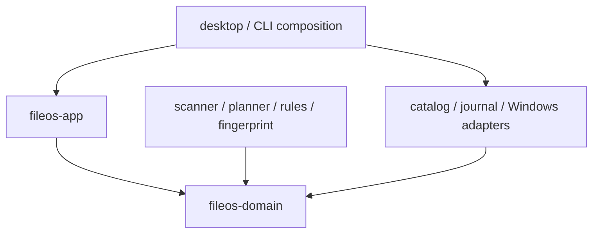

# Core crates

This directory contains the Rust core boundaries introduced by the active Execution Plan. Milestone 5 keeps the typed scan contracts, deterministic fixture support, bounded scanner and no-follow platform observation from M4, and activates `fileos-catalog` with SQLite migration v1, bounded scan upserts, conservative absence reconciliation and typed queries/errors. No crate in the current scope exposes user-file mutation.

## Planned crates

| Crate | Owns | Must not own |
|---|---|---|
| `fileos-domain` | entities, value objects, state transitions, invariant types | UI, SQL, Tauri, direct OS calls |
| `fileos-app` | use cases, command/query ports, orchestration, DTO mapping | React views, concrete SQL, unsafe path shortcuts |
| `fileos-scanner` | bounded read-only enumeration, metadata observation, checkpoints | mutation, duplicate deletion, UI progress rendering |
| `fileos-catalog` | SQLite migrations, repositories, queries, transaction boundaries | filesystem truth claims, UI SQL |
| `fileos-fingerprint` | staged quick/full fingerprints and optional byte verification | keeper policy, deletion |
| `fileos-classifier` | deterministic categories and findings | plan execution |
| `fileos-rules` | versioned predicates, precedence, explainable proposals | filesystem access |
| `fileos-planner` | immutable plans, preconditions, risks, conflict detection | direct mutation |
| `fileos-executor` | approved plan execution and verification | ad-hoc/unplanned file operations |
| `fileos-journal` | durable event log, reconciliation, recovery/undo support | pretending database state is filesystem truth |
| `fileos-watcher` | bounded event ingestion and targeted re-observation hints | mutation, final truth decisions |
| `fileos-platform-windows` | Windows path, identity, capability, and filesystem adapters | product policy, UI decisions |
| `fileos-testkit` | disposable fixtures, fakes, fault injection, manifests | production-only secrets or real user data |

## Dependency rules

- `fileos-domain` is the innermost crate and remains infrastructure-independent.
- Cross-crate communication uses typed public contracts; do not expose internal database rows.
- Only the composition root chooses concrete adapters.
- No cyclic dependencies.
- Core crates do not depend on React, browser globals, or Tauri window types.
- Mutation-capable platform methods are exposed only through the executor port.
- Test-only fault injection is behind test features or `fileos-testkit`; it must not be enabled in release artifacts.

## Crate baseline

Every new crate should start with:

- a one-paragraph responsibility statement in its README or crate docs;
- `#![forbid(unsafe_code)]` unless a reviewed ADR justifies a narrower exception;
- typed errors at public boundaries;
- no unchecked `unwrap`/`expect` on user or filesystem input;
- unit tests beside pure logic and integration tests under `tests/`;
- explicit feature flags with safe defaults;
- no dependency until its purpose and maintenance/security cost are recorded.

## Introduction order

1. `fileos-domain`
2. `fileos-app`
3. `fileos-testkit`
4. `fileos-catalog`
5. `fileos-scanner`
6. read-only CLI composition
7. fingerprint/classifier/rules/planner
8. journal and executor only after read-only gates pass
9. watcher after rescan correctness and overflow policy are proven

See [Architecture](../docs/ARCHITECTURE.md), [Safety Invariants](../docs/SAFETY-INVARIANTS.md), and [Test Strategy](../docs/TEST-STRATEGY.md).
