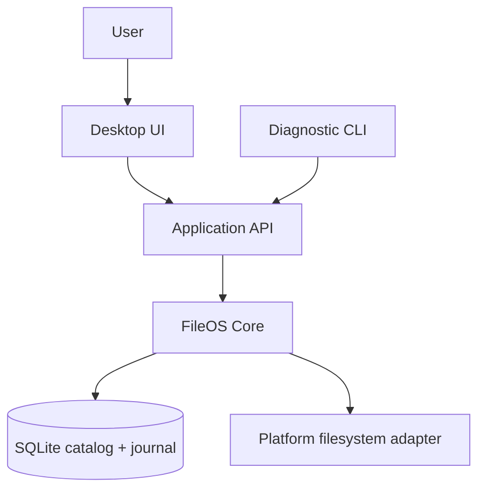
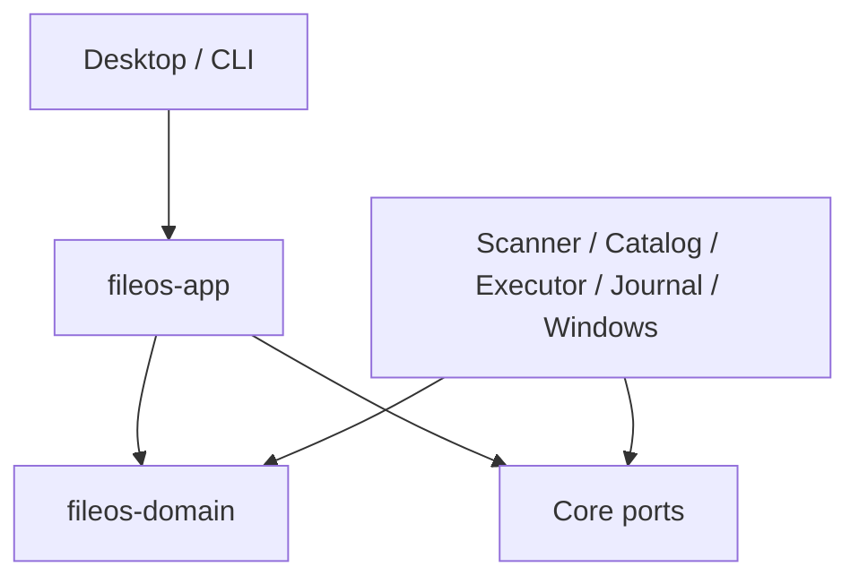
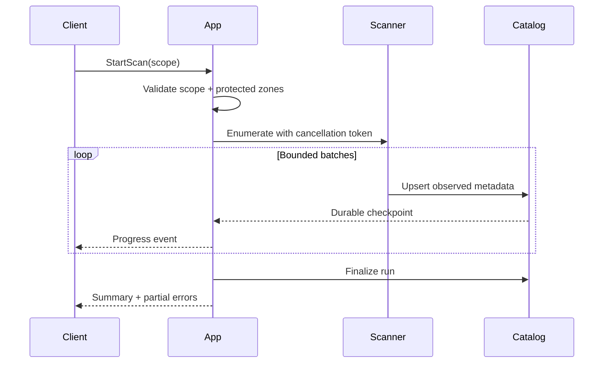
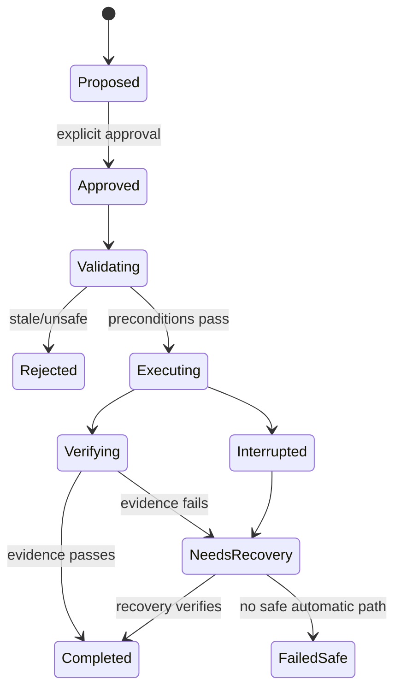

# MH FileOS — Architecture

**Document ID:** ARCH-001  
**Status:** Accepted for EP-000 implementation
**Scope:** MVP desktop application, Windows-first  
**Last updated:** 2026-07-14

This document defines the target technical architecture for MH FileOS. It is subordinate to [SAFETY-INVARIANTS.md](./SAFETY-INVARIANTS.md): when architecture and safety conflict, safety wins.

## 1. Architectural goals

The architecture must make these properties natural rather than optional:

1. No filesystem mutation can bypass planning, validation, journaling, and verification.
2. Core behavior is testable without a GUI and without touching real user data.
3. Scanning remains responsive on large datasets and slow or removable volumes.
4. Interrupted operations can be explained and recovered deterministically.
5. Windows path, identity, link, locking, and cross-volume semantics are explicit.
6. UI and automation clients use the same typed application contracts.
7. Performance optimizations never weaken correctness or safety evidence.

### 1.1 Non-goals for the MVP

- Distributed or cloud-hosted indexing.
- Multi-user collaboration.
- Kernel-mode filesystem drivers.
- Transparent replacement for Windows Explorer.
- Automatic organization without a user-approved plan.
- AI-directed filesystem mutations.
- macOS and Linux parity before Windows safety gates pass.

## 2. Chosen stack

| Layer | Choice | Rationale |
|---|---|---|
| Core engine | Rust stable | Strong type system, predictable resource use, safe concurrency, native filesystem access |
| Desktop shell | Tauri 2 | Small native shell and explicit command/capability surface |
| UI | React + TypeScript | Mature component ecosystem and typed client contracts |
| Local database | SQLite, WAL mode | Embedded, transactional, debuggable, supports migrations and FTS5 |
| Async runtime | Tokio, selectively | Bounded concurrent I/O and cancellation; no unbounded task spawning |
| Content hashing | BLAKE3 by default | High throughput; algorithm/version stored with every fingerprint |
| Serialization | Serde + versioned DTOs | Stable boundary between core, CLI, database, and UI |
| Observability | `tracing` with redaction | Structured diagnostics without leaking file names by default |

These are target choices, not permission to add dependencies automatically. Dependency changes follow `AGENTS.md` and the active Execution Plan.

## 3. System context



The desktop UI and diagnostic CLI are clients. They do not own scanning, duplicate decisions, protected-zone policy, or mutations. Those rules live in the core.

## 4. Target repository layout

The following layout is introduced incrementally by approved milestones:

```text
MH-FileOS/
├─ apps/
│  ├─ desktop/                   # Tauri + React client
│  └─ fileos-cli/                # read-only diagnostics and fixture workflows
├─ crates/
│  ├─ fileos-domain/             # entities, value objects, invariants
│  ├─ fileos-app/                # use cases and command/query ports
│  ├─ fileos-scanner/            # metadata enumeration pipeline
│  ├─ fileos-catalog/            # SQLite persistence and migrations
│  ├─ fileos-fingerprint/        # staged hashing and byte verification
│  ├─ fileos-classifier/         # categories and finding production
│  ├─ fileos-rules/              # deterministic rule evaluation
│  ├─ fileos-planner/            # immutable action-plan construction
│  ├─ fileos-executor/           # transactional filesystem operations
│  ├─ fileos-journal/            # operation/event journal and recovery
│  ├─ fileos-watcher/            # incremental change ingestion
│  ├─ fileos-platform-windows/   # Windows identity/path/filesystem adapter
│  └─ fileos-testkit/            # fixtures, fakes, fault injection
├─ docs/
└─ fixtures/
```

## 5. Dependency direction



Rules:

- `fileos-domain` has no UI, Tauri, SQLite, Tokio, or operating-system dependency.
- `fileos-app` orchestrates use cases through traits/ports and does not import a concrete UI.
- Infrastructure crates implement ports; the application layer does not depend on their internals.
- `apps/desktop` may depend on DTO/contracts and application composition only.
- The UI never imports a database or platform adapter.
- No crate may call the mutation adapter except through an approved executor use case.
- Cyclic crate dependencies are forbidden.

## 6. Command/query boundary

Queries are read-only:

- select scan scope candidates;
- inspect catalog and scan status;
- list findings and duplicate groups;
- preview an action plan;
- inspect operation history and recovery state.

Commands change application or filesystem state:

- create/update an explicit scope definition;
- start/cancel a scan;
- approve or reject a plan;
- execute, pause, resume, recover, or undo an operation.

Every command has:

1. a versioned request DTO;
2. validation at the application boundary;
3. an authorization/scope decision;
4. a typed result or typed error;
5. an operation/correlation ID when asynchronous;
6. structured events for observable progress.

Tauri commands are thin adapters. They deserialize, call one application use case, and serialize the result. They do not contain SQL, path policy, duplicate logic, or filesystem mutation.

## 7. Core domain model

Principal entities and value objects:

| Type | Purpose |
|---|---|
| `VolumeId` | Stable volume identity; never inferred from a drive letter alone |
| `FileIdentity` | Volume identity plus platform file ID when available |
| `NormalizedPath` | Display path plus comparison representation and normalization version |
| `ScanScope` | Explicit included roots, exclusions, and policy version |
| `ScanRun` | Snapshot metadata, lifecycle, counters, errors, and checkpoints |
| `FileEntry` | Observed metadata; not proof the file still exists later |
| `Fingerprint` | Algorithm, version, stage, input metadata, digest, completion status |
| `Finding` | Explainable observation such as exact duplicate, large file, empty directory |
| `RuleSet` | Versioned deterministic rules and precedence |
| `ActionPlan` | Immutable proposed actions plus preconditions and risk summary |
| `PlanItem` | One typed action, source, destination, preconditions, rollback intent |
| `Operation` | Execution lifecycle and aggregate outcome |
| `OperationEvent` | Append-only evidence for one transition or verification result |
| `ProtectedZone` | Core-enforced path/identity policy that cannot be bypassed by the UI |

All IDs are opaque and serializable. Persisted enums are versioned; unknown enum values must fail safely rather than default to a destructive behavior.

## 8. Main data flows

### 8.1 Read-only scan



Scanner guarantees:

- no filesystem writes;
- bounded queues and open handles;
- explicit behavior for links/reparse points;
- inaccessible entries become typed partial errors, not a fabricated complete scan;
- cancellation produces a resumable or clearly aborted state;
- database commits happen in bounded batches.

### 8.2 Exact-duplicate pipeline

Candidates advance only when evidence strengthens:

1. group regular files by exact byte size;
2. exclude ineligible/protected/transient entries;
3. calculate a versioned quick fingerprint for candidate groups;
4. calculate a full BLAKE3 digest;
5. when policy or platform risk requires, byte-compare before destructive eligibility;
6. refresh identity, size, and modification preconditions;
7. publish a finding with confidence and evidence.

Names, extensions, timestamps, perceptual similarity, or AI classification never prove exact duplication.

### 8.3 Plan construction

The planner consumes a stable catalog snapshot and produces an immutable plan. It never mutates files. A plan contains:

- scope and policy versions;
- catalog snapshot/checkpoint;
- every source and destination;
- action type and rationale;
- preconditions and protected-zone decisions;
- conflict strategy;
- estimated bytes/time and volume transitions;
- rollback or quarantine intent;
- risk flags that require explicit acknowledgement.

Plan identifiers are content-addressed or otherwise tamper-evident. Editing a plan creates a new version.

### 8.4 Execution



The executor performs one plan item at a time through the platform adapter. Before each irreversible step it writes journal intent durably. It records observed facts after each step and does not infer success from an attempted API call.

Cross-volume moves use copy → verify → retire-source. The source is not retired if verification does not pass. Details and forbidden transitions are defined in `SAFETY-INVARIANTS.md`.

### 8.5 Recovery and undo

On startup the journal identifies operations without a terminal state. Recovery derives the next safe action from durable events plus current filesystem observations. It never treats the database alone as proof of filesystem state.

Undo is a new planned operation. It revalidates source/destination identities and conflicts, then records its own journal. Undo cannot silently overwrite a path created after the original operation.

### 8.6 Watcher ingestion

Watcher events are hints, not ground truth. They enter a bounded, deduplicated queue and cause targeted re-observation. Overflow, lost events, volume disconnects, or rename ambiguity trigger a scoped rescan. Watcher processing has no mutation permission.

## 9. SQLite architecture

SQLite is a local catalog and journal, not the ultimate truth about the filesystem.

### 9.1 Operational settings

- WAL mode after capability verification.
- Foreign keys enabled on every connection.
- Busy timeout configured explicitly.
- One migration owner and versioned forward migrations.
- Short write transactions; no hashing or filesystem I/O inside a database transaction.
- Application-level repository interfaces; no UI SQL.
- Integrity check and migration backup policy before production upgrades.

### 9.2 Logical schema

| Table | Important fields |
|---|---|
| `volumes` | id, platform identity, filesystem, capabilities, last_seen_at |
| `scan_roots` | id, volume_id, display_path, normalized_path, policy_version |
| `scan_runs` | id, scope_version, status, checkpoint, counters, started/ended_at |
| `file_entries` | id, run_id, parent_id, identity, paths, kind, size, timestamps, flags |
| `fingerprints` | entry_id, algorithm, version, stage, digest, input facts, status |
| `findings` | id, type, evidence_version, confidence, status, explanation |
| `finding_members` | finding_id, entry_id, role, evidence |
| `rule_sets` / `rules` | version, priority, predicate, action proposal, enabled |
| `action_plans` | id, version, snapshot, policy, status, risk summary |
| `plan_items` | plan_id, ordinal, typed action, preconditions, rollback intent |
| `operations` | id, plan_id, status, aggregate result, timestamps |
| `operation_events` | operation_id, sequence, event_type, facts, durable_at |
| `protected_zones` | identity/path rule, source, policy version, enabled |
| `ignore_patterns` | scope, syntax version, pattern, provenance |

Binary digests are stored as binary values with an explicit algorithm and schema version. Paths retain a human-display representation and a comparison representation; one must never be reconstructed from the other.

## 10. Windows filesystem semantics

Windows is the first-class platform for the MVP.

### 10.1 Identity and paths

- A drive letter is a mount alias, not stable volume identity.
- Prefer volume serial/GUID plus file ID where supported.
- Use handle-based final-path and identity checks for mutation preconditions.
- Support extended-length paths without ad-hoc `MAX_PATH` truncation.
- Preserve original display path and Unicode; comparison follows explicit Windows semantics.
- Treat case behavior as a volume/directory capability, not a universal lowercase rule.
- Detect alternate data streams and record policy; do not silently discard them during copy.
- Distinguish files, directories, symlinks, junctions, mount points, and other reparse points.
- Detect hard links so two directory entries to the same file identity are not reported as independent recoverable copies.

### 10.2 Reparse points

The scanner does not follow reparse points by default. If a later scope enables traversal, it must:

- resolve the target safely;
- prove it remains inside approved scope;
- maintain a visited identity set;
- enforce a depth bound;
- report cycles and escapes explicitly.

The executor never follows a reparse point implicitly while validating or mutating a target.

### 10.3 Locks and sharing violations

Locked or in-use files produce typed, retryable outcomes. The MVP does not force-close handles, take ownership, alter ACLs, or use privileged deletion as a fallback.

### 10.4 Removable and network storage

Volume disappearance pauses relevant work and records an interruption. Reconnection must match the stable volume identity before resume. Network shares are read-only experimental scope until dedicated correctness and fault tests pass.

## 11. Concurrency, scheduling, and backpressure

The system uses structured concurrency with parent-owned cancellation. Every queue is bounded.

Recommended initial controls, tuned only by benchmarks:

- directory enumeration workers: per-volume limit;
- metadata queue: bounded batch count;
- hashing workers: CPU and volume-aware semaphore;
- one large sequential read per rotational volume by default;
- database writer: one ordered batching task;
- UI progress events: sampled/coalesced, never one IPC event per file;
- mutation executor: serial by default, later parallel only for proven independent volumes.

Memory use must scale with configured queue bounds, not total file count. A slow database or UI consumer must apply backpressure rather than cause unbounded buffering.

## 12. Error model

Errors are typed and preserve context without exposing secrets by default:

```text
FileOsError
├─ ScopeViolation { operation_id, protected_reason }
├─ StalePlan { plan_id, failed_precondition }
├─ PathConflict { item_id, conflict_kind }
├─ AccessDenied { operation, redacted_path_id, retryable }
├─ VolumeUnavailable { volume_id, retryable }
├─ VerificationFailed { item_id, expected, observed }
├─ Catalog { code, migration_version, retryable }
├─ Cancelled { checkpoint }
└─ Internal { correlation_id }
```

Errors shown in the UI include a plain-language explanation, safe next action, and correlation ID. Internal details go to redacted diagnostics. `panic!`, unchecked `unwrap`, and broad string matching are not normal control flow.

Partial scan failures are modeled separately from a total scan failure. A scan with skipped entries cannot be labeled complete without qualification.

## 13. Security and privacy boundary

- Local-first; no account or network required for the MVP.
- No remote scripts or remote UI content.
- Tauri Content Security Policy is explicit and restrictive.
- Capabilities expose only the commands required by each window.
- Devtools and debug commands are disabled in release builds unless deliberately enabled.
- The core validates every path and operation; UI validation is convenience only.
- Never interpolate paths into a shell command.
- File content is not placed in logs, analytics, prompts, or diagnostics.
- File names and full paths are redacted by default using stable local tokens.
- Telemetry is off unless a later opt-in design receives explicit approval.
- Update binaries require versioned signing and verification before automatic updates are considered.
- AI may explain or propose rules, but deterministic code validates and executes them.

## 14. Configuration

Configuration layers, from lowest to highest precedence:

1. safe built-in defaults;
2. versioned local application configuration;
3. user settings;
4. per-operation explicit options.

Safety invariants and protected zones are not overridable by ordinary settings. Unknown or invalid settings fail to safe defaults and generate a visible diagnostic. Secrets are not expected in the MVP configuration.

## 15. Performance budget

Initial engineering targets; all published claims require named hardware and datasets:

| Scenario | Target |
|---|---|
| App interactive shell | ≤ 2 s warm start on reference machine |
| Initial metadata scan | ≥ 100k entries/min on reference NVMe fixture |
| UI progress cadence | visible update every 250–1000 ms without event flooding |
| UI main-thread long task | no recurring task > 50 ms during scan |
| Catalog query, common views | p95 ≤ 100 ms at 1 million entries |
| Steady metadata memory | bounded and documented at 1 million entries |
| Cancellation acknowledgement | ≤ 2 s, excluding an uninterruptible OS call |

These are budgets, not guaranteed product claims. `TEST-STRATEGY.md` defines reporting requirements.

## 16. Architectural decision records

Create an ADR in `docs/adr/` for a decision that is expensive to reverse, changes a safety boundary, or introduces a central dependency.

Initial ADR queue:

| ID | Decision | Status |
|---|---|---|
| ADR-001 | Rust core + Tauri 2 + React | Proposed |
| ADR-002 | SQLite catalog and append-only operation events | Proposed |
| ADR-003 | Windows identity and path representation | Research required |
| ADR-004 | BLAKE3 duplicate fingerprint with optional byte verification | Proposed |
| ADR-005 | Quarantine layout and retention policy | Decision required |
| ADR-006 | Cross-volume verification and source-retirement protocol | Proposed |
| ADR-007 | Local-only diagnostics and redaction model | Proposed |

Each ADR records context, decision, alternatives, safety impact, migration/reversal cost, and test evidence.

## 17. Architecture acceptance criteria

The architecture is ready to leave Sprint 0 only when:

- crate boundaries and dependency direction are represented by a compiling workspace;
- the domain and application crates compile without Tauri or React;
- the scanner can run against `fixtures/sandbox` without mutation capability;
- SQLite migrations and repositories pass integration tests;
- no mutation API exists outside the executor port;
- path and identity behavior has Windows-specific tests;
- queue and worker bounds are configuration-visible and tested;
- release CSP/capability configuration has a security test;
- all deviations from this document are recorded in ADRs or an active Execution Plan.

## 18. Open technical questions

1. Exact Windows APIs and compatibility floor for stable file identity.
2. Whether full byte comparison is mandatory for all destructive duplicate actions or only configured risk classes.
3. Quarantine placement for same-volume atomicity versus centralized user visibility.
4. Minimum SQLite/FTS feature set bundled with the application.
5. Watcher implementation and overflow behavior across supported Windows versions.
6. Whether network paths remain excluded from MVP mutation permanently.

Open questions must not be silently resolved in code. Record the decision in an ADR and update the applicable safety/test contracts.
